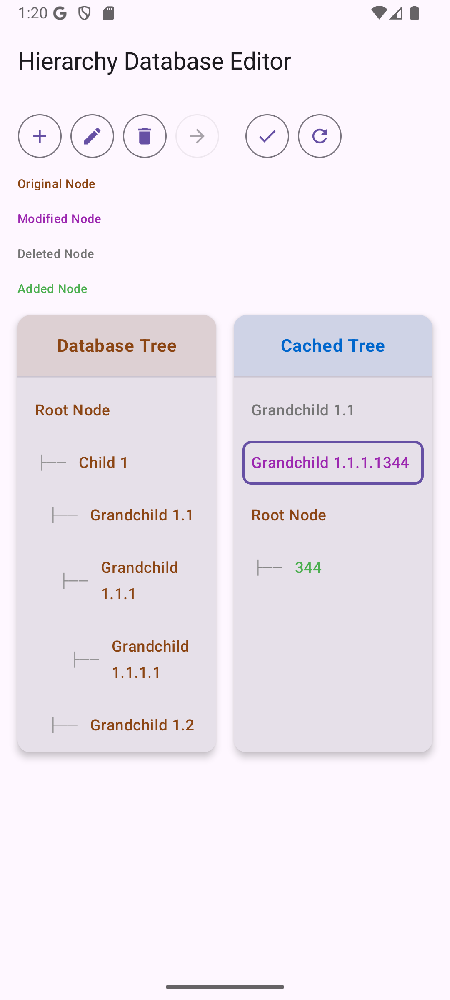

# 🌳 Hierarchy Editor - Database & Cache Management

A sophisticated hierarchical data management interface built with Kotlin Multiplatform and Compose. The application provides a dual-panel interface for managing tree-structured data with database persistence and local caching capabilities.

## 🎯 Overview

Hierarchy Editor is designed to solve the challenge of managing large hierarchical datasets efficiently. The application features a split-screen interface where users can:

- **Left Panel (Database)**: View and manage persistent hierarchical data
- **Right Panel (Cache)**: Work with a local subset of data for batch operations
- **Controls**: Apply changes, reset cache, move, delete, change name

## 📱 Screenshots

  

## 🏗️ Technical Architecture

### Core Components

#### 🗄️ TreeStateCache
- Manages in-memory hierarchical structure
- Tracks node status (Added, Modified, Deleted, Unchanged)
- Provides efficient tree traversal and manipulation
- Emits state changes via Kotlin Flows

#### ⏳ PendingOperationsQueue
- Queues user operations before database application
- Supports atomic batch operations
- Generates temporary IDs for new nodes

#### 🎯 HierarchyCacheCoordinator
- Orchestrates database-cache synchronization
- Handles error states and recovery
- Manages data consistency across components

## 🚀 Getting Started

### Prerequisites
- JDK 17+
- Android Studio or IntelliJ IDEA
- Kotlin Multiplatform setup

### Key User Flows
1. **Explore Database**: Browse hierarchical data in the left panel
2. **Move to Cache**: Select database nodes and move them to cache
3. **Edit in Cache**: Modify, add, or delete nodes in the right panel
4. **Apply Changes**: Use the Apply button to persist all cache changes
5. **Reset if Needed**: Clear cache and start over with Reset button

## 🧪 Testing Strategy

### Unit Tests
- Data layer components (caches, sources, coordinators)
- Mapper logic for data transformations
- Business logic validation

## 🔮 Future Enhancements

### Performance Improvements
- **Virtual Scrolling**: Handle very large hierarchies efficiently
- **Background Sync**: Periodic cache-database synchronization
- **Conflict Resolution**: Advanced merge strategies for concurrent edits

### User Experience
- **Search & Filter**: Find specific nodes in large hierarchies
- **Keyboard Shortcuts**: Power user workflow optimization
- **Drag & Drop**: Visual node movement between panels
- **Integration tests and screenshot tests**: decrease bug rate

### Data Management
- **Export/Import**: Share hierarchical data across systems
- **Version History**: Track changes over time
- **Backup/Restore**: Data safety and recovery mechanisms

### Integration tests and screenshot tests

- **UI Consistency**: Ensure visual elements render correctly across platforms

---

Built with using Kotlin Multiplatform and Solid principles